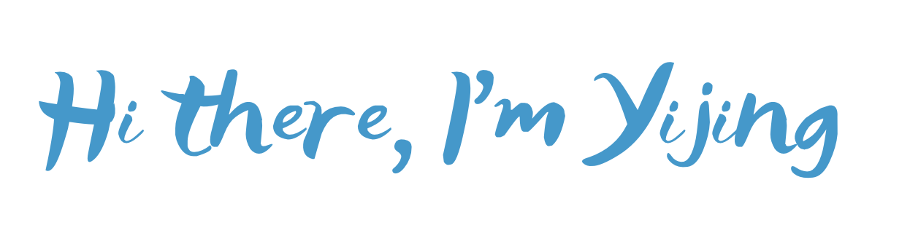

### ✨ About Me

<!-- deploy github readme stats at vercel to link my private repos -->
|  |  |
| ------------- | ------------- |

### 🛠 Things I use...

### 💬 Ask me about anything [here](https://github.com/yijing-wu/yijing-wu/issues)

****

  
<b>Things used in this README</b>

   
  <ol>
    <li>
      <a href="https://github.com/Nathan13888/VisitorBadgeReloaded">Visitor Badge Reloaded</a>
    </li>
    <li>
      <a href="https://github.com/anuraghazra/github-readme-stats">github-readme-stats</a>
    </li>
        <li>
      <a href="https://github.com/Envoy-VC/awesome-badges">Awesome Badges</a>
    </li>
  </ol>

 

<!--
**yijing-wu/yijing-wu** is a ✨ _special_ ✨ repository because its `README.md` (this file) appears on your GitHub profile.

Here are some ideas to get you started:

- 🔭 I’m currently working on ...
- 🌱 I’m currently learning ...
- 👯 I’m looking to collaborate on ...
- 🤔 I’m looking for help with ...
- 💬 Ask me about ...
- 📫 How to reach me: ...
- 😄 Pronouns: ...
- ⚡ Fun fact: ...
-->